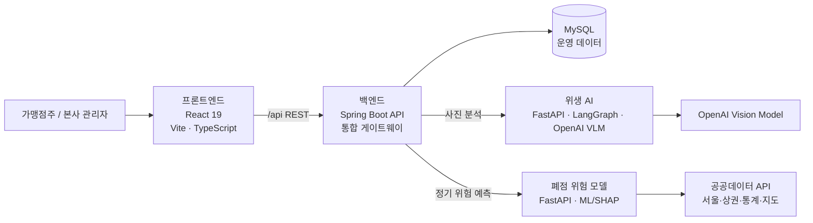

# OhDomi React dashboard

## Run locally

```powershell
npm install
npm run dev
```

Vite proxies `/api` to `http://127.0.0.1:8080` during local development. For a
separately hosted Spring API, set `VITE_API_BASE_URL` before building or running
the app.

The owner hygiene page loads model checklist items from Spring, accepts JPG, PNG,
or WebP images up to 10MB, submits them to `/api/hygiene-inspections/analyze`, and
refreshes the saved score, item result, history, and improvement tasks after a
successful analysis.

## Verification

```powershell
npm run build
npm run lint
```
