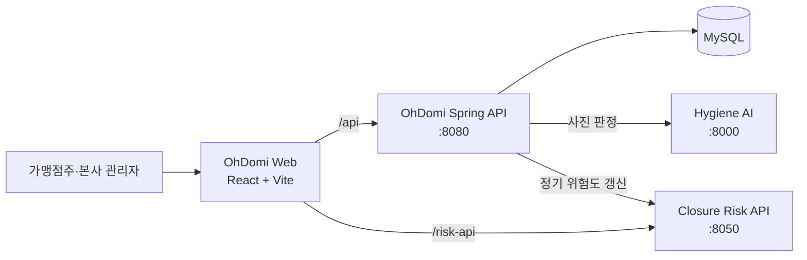

# OhDomi Web

가맹점주와 본사 관리자가 매장 운영 현황을 한곳에서 확인하는 OhDomi 통합 대시보드입니다. React와 TypeScript로 구현되었으며 Spring API, 위생 판정 AI, 폐점·재계약 리스크 모델을 연결합니다.

## 주요 기능

### 가맹점주

- 매출, 주문, 위생 점수 요약 대시보드
- 매장 정보, 시설 점검, 근무 일정 관리
- 위생 사진 업로드 및 AI 판정 결과·개선 과제 확인
- 기간별 매출 분석과 재고 기반 발주 추천
- 공지사항 조회 및 문의 등록

### 본사 관리자

- 전체 가맹점, 매출, 위생 현황 통합 조회
- 매장별 폐점·재계약 위험도와 주요 영향 요인 확인
- 재계약 대상, 전체 매장 위험 순위, 매장 상세 분석
- 희망 상권 탐색과 신규 가맹 상담 자료 생성
- 공지·문의 게시판 운영

## 시스템 구성



개발 서버는 `/api` 요청을 Spring의 `http://127.0.0.1:8080`으로, `/risk-api` 요청을 리스크 모델의 `http://127.0.0.1:8050`으로 프록시합니다.

## 기술 스택

- React 19
- TypeScript 5
- Vite 5
- React Router 7
- ESLint 8

## 로컬 실행

### 사전 준비

- Node.js와 npm
- [OhDomiSpring](https://github.com/OhDomi/OhDomiSpring) (`:8080`)
- 위생 판정 기능 사용 시 [hygiene_ai](https://github.com/OhDomi/hygiene_ai) (`:8000`)
- 리스크·상권 기능 사용 시 [closure-risk-model](https://github.com/OhDomi/closure-risk-model) (`:8050`)

### 설치 및 시작

```powershell
npm ci
Copy-Item .env.example .env
npm run dev
```

브라우저에서 `http://localhost:5173`을 엽니다. 로컬 프록시를 사용할 때 `.env`의 `VITE_API_BASE_URL`은 비워 둡니다.

네 저장소가 같은 상위 작업 폴더에 준비되어 있다면, 작업 폴더의 통합 실행 스크립트로 네 서비스를 함께 시작할 수 있습니다.

```powershell
..\start-all-servers.bat --check
..\start-all-servers.bat
```

첫 명령은 서버를 시작하지 않고 필수 파일과 실행 환경만 확인합니다.

## 환경 변수

| 변수 | 기본값 | 설명 |
| --- | --- | --- |
| `VITE_API_BASE_URL` | 빈 문자열 | API가 다른 오리진에 있을 때 사용할 공통 베이스 URL. 끝의 `/`는 생략합니다. |

`VITE_API_BASE_URL`은 `/api`와 `/risk-api` 양쪽 요청에 모두 적용됩니다. 운영 환경에서는 지정한 베이스 URL의 리버스 프록시가 두 경로를 각각 Spring과 Risk API로 전달해야 합니다.

## 데모 로그인

Spring의 기본 시드 데이터를 사용하면 다음 계정으로 확인할 수 있습니다.

| 역할 | 아이디 | 비밀번호 |
| --- | --- | --- |
| 가맹점주 | `demo` | `1234` |
| 본사 관리자 | `admin` | `1234` |

데모 계정은 로컬 시연 전용입니다. 외부에 배포할 때는 기본 계정과 비밀번호를 반드시 교체하세요.

## 주요 화면 경로

| 경로 | 화면 |
| --- | --- |
| `/overview` | 역할별 통합 대시보드 |
| `/stores` | 매장 관리 |
| `/hygiene` | 위생 점검 |
| `/sales` | 매출 현황·분석 |
| `/orders` | 발주 관리 |
| `/forecast` | 위험 예측 |
| `/renewal-check` | 재계약 대상 점검 |
| `/store-risk-list` | 전체 매장 위험 순위 |
| `/district-prospect` | 희망 상권 탐색 |
| `/board` | 공지·문의 게시판 |

로그인 전에는 인증 화면이 표시됩니다. 로그인 후 새로고침 시 Spring의 `/api/auth/me`를 호출해 세션을 복구합니다.

## 명령어

```powershell
npm run dev       # 개발 서버
npm run build     # TypeScript 검사 후 운영 빌드
npm run preview   # dist 빌드 미리보기
npm run lint      # ESLint 검사
```

## 운영 배포 체크리스트

- `npm run build` 결과인 `dist/`를 정적 호스팅합니다.
- `BrowserRouter` 경로를 직접 열어도 동작하도록 모든 화면 경로를 `index.html`로 폴백합니다.
- `/api`는 Spring, `/risk-api`는 Risk API로 프록시합니다.
- 인증 요청은 쿠키를 사용하므로 HTTPS, CORS 허용 오리진, `credentials` 전달 설정을 함께 확인합니다.
- 모델·데이터 번들이 없는 Risk API에서는 일부 위험 예측 및 문서 생성 기능이 동작하지 않습니다.

## 디렉터리 구조

```text
src/api/          API 호출, 인증 세션, 공통 로딩·오류 상태
src/components/   공통 UI 컴포넌트
src/pages/        가맹점주·관리자 화면
src/types/        게시판·리스크 공통 타입
public/risk-tool/ 리스크 도구용 정적 데이터와 레거시 화면
```

## 관련 저장소

- [OhDomiSpring](https://github.com/OhDomi/OhDomiSpring) — 인증, 운영 데이터, 통합 API
- [hygiene_ai](https://github.com/OhDomi/hygiene_ai) — 사진 기반 위생 판정
- [closure-risk-model](https://github.com/OhDomi/closure-risk-model) — 폐점·재계약 위험 및 상권 분석
